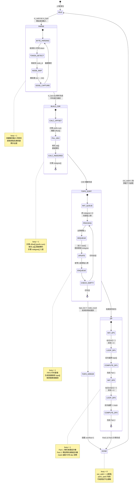
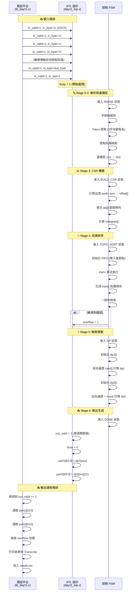
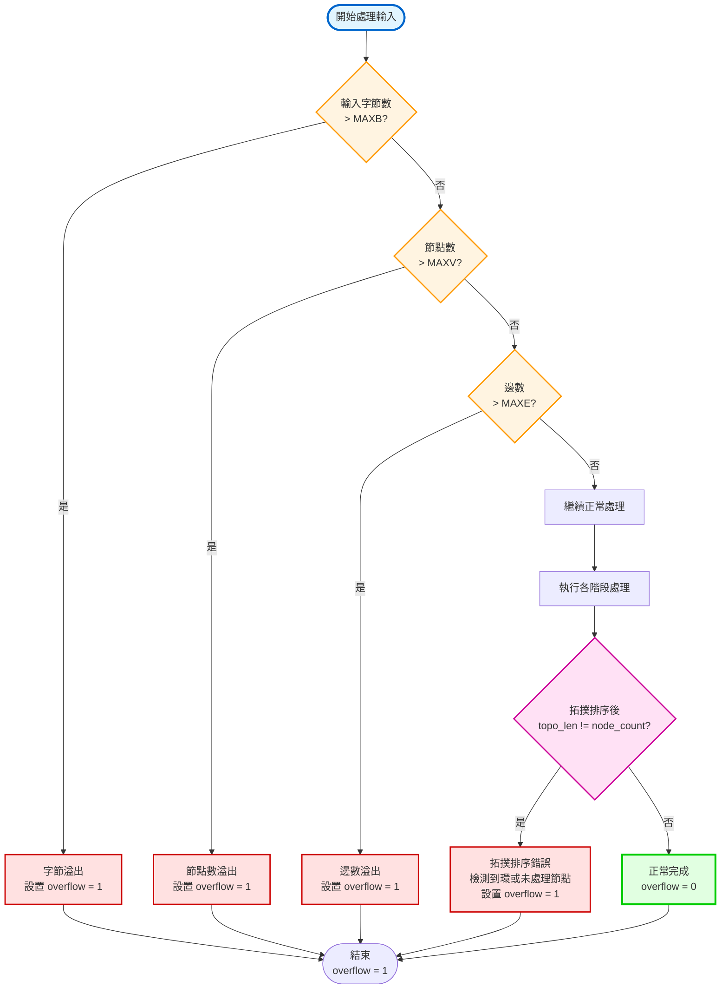

# AoC 2025 Day 11 RTL 專案流程圖

這份文件包含 AoC 2025 Day 11 RTL 專案的完整流程圖，展示從串流輸入到最終輸出的完整數據處理流程。

## 1. 整體架構流程圖

```mermaid
flowchart TB
    subgraph Input["📥 輸入介面"]
        IN_VALID["in_valid<br/>輸入有效信號"]
        IN_BYTE["in_byte[7:0]<br/>ASCII 字節"]
        IN_LAST["in_last<br/>流結束標記"]
    end

    subgraph Stage0["🔤 Stage 0: 串流輸入處理"]
        S0[串流解析 FSM<br/>字節級解析器]
    end

    subgraph Stage1["🏷️ Stage 1: 詞彙化與節點映射"]
        S1[Token 提取<br/>3字母節點名稱識別]
        NODE_TABLE[節點名稱表<br/>name ↔ ID 映射<br/>存儲: MAXV 個節點]
    end

    subgraph Stage2["🔗 Stage 2: 邊捕捉"]
        S2[邊解析器<br/>src → dst]
        EDGE_RAM[邊 RAM<br/>存儲 src_id, dst_id<br/>大小: MAXE]
        OUTDEGREE[出度計數器<br/>每個節點的出邊數]
    end

    subgraph Stage3["📊 Stage 3: CSR 構建"]
        S3[壓縮稀疏行格式<br/>CSR 轉換引擎]
        OFFSET_RAM[offset[u]<br/>節點 u 的起始索引<br/>大小: MAXV+1]
        ADJ_RAM[adj[]<br/>鄰接陣列<br/>大小: MAXE]
        INDEGREE[入度計數器<br/>每個節點的入邊數<br/>大小: MAXV]
    end

    subgraph Stage4["🔢 Stage 4: 拓撲排序"]
        S4[Kahn 算法引擎<br/>拓撲排序處理器]
        FIFO_QUEUE[FIFO 佇列<br/>零入度節點管理]
        TOPO_ORDER[拓撲順序陣列<br/>topo[]<br/>大小: MAXV]
        CHECK[一致性檢查器<br/>topo_len == node_count?]
    end

    subgraph Stage5["⚡ Stage 5: 動態規劃"]
        S5A[Part 1: 無約束路徑計數<br/>dp1[u] = Σ dp1[v]<br/>從後往前遍歷]
        S5B[Part 2: 帶訪問約束路徑計數<br/>dp2[u][mask] = Σ dp2[v][mask']<br/>mask: fft(bit0), dac(bit1)]
        DP1_RAM[DP1 陣列<br/>dp1[out] = 1<br/>dp1[you] = Part1答案<br/>大小: MAXV]
        DP2_RAM[DP2 陣列<br/>dp2[svr][11] = Part2答案<br/>mask: 0-3 (2位)<br/>大小: 4*MAXV]
    end

    subgraph Stage6["📤 Stage 6: 輸出生成"]
        S6[結果鎖存器與輸出控制器]
        OUT[輸出介面<br/>out_valid<br/>part1[63:0]<br/>part2[63:0]<br/>overflow]
    end

    subgraph Control["🎛️ 控制 FSM"]
        FSM[主控制狀態機<br/>IDLE → PARSE → BUILD_CSR<br/>→ TOPO_SORT → DP → DONE]
        BUSY[busy 信號<br/>處理中標誌<br/>PARSE 到 DP 期間為 1]
        OVERFLOW[overflow 信號<br/>資源溢出檢測<br/>或一致性錯誤]
    end

    Input --> S0
    S0 --> S1
    S1 --> NODE_TABLE
    NODE_TABLE --> S2
    S2 --> EDGE_RAM
    S2 --> OUTDEGREE
    EDGE_RAM --> S3
    OUTDEGREE --> S3
    S3 --> OFFSET_RAM
    S3 --> ADJ_RAM
    S3 --> INDEGREE
    OFFSET_RAM --> S4
    ADJ_RAM --> S4
    INDEGREE --> S4
    S4 --> FIFO_QUEUE
    FIFO_QUEUE --> TOPO_ORDER
    TOPO_ORDER --> CHECK
    CHECK --> S5A
    CHECK --> S5B
    TOPO_ORDER --> DP1_RAM
    TOPO_ORDER --> DP2_RAM
    ADJ_RAM --> DP1_RAM
    ADJ_RAM --> DP2_RAM
    DP1_RAM --> S6
    DP2_RAM --> S6
    S6 --> OUT

    FSM -.控制.-> S0
    FSM -.控制.-> S1
    FSM -.控制.-> S2
    FSM -.控制.-> S3
    FSM -.控制.-> S4
    FSM -.控制.-> S5A
    FSM -.控制.-> S5B
    FSM -.控制.-> S6
    FSM --> BUSY
    CHECK --> OVERFLOW
    FSM --> OVERFLOW

    style Input fill:#e1f5ff,stroke:#0066cc,stroke-width:2px
    style Stage0 fill:#fff4e1,stroke:#ff9900,stroke-width:2px
    style Stage1 fill:#fff4e1,stroke:#ff9900,stroke-width:2px
    style Stage2 fill:#fff4e1,stroke:#ff9900,stroke-width:2px
    style Stage3 fill:#ffe1f5,stroke:#cc0099,stroke-width:2px
    style Stage4 fill:#e1ffe1,stroke:#00cc00,stroke-width:2px
    style Stage5 fill:#f5e1ff,stroke:#9900cc,stroke-width:2px
    style Stage6 fill:#ffe1e1,stroke:#cc0000,stroke-width:2px
    style Control fill:#f0f0f0,stroke:#666666,stroke-width:2px
```

## 2. 控制狀態機詳細流程



## 3. 數據結構與記憶體映射關係

```mermaid
graph LR
    subgraph Stage1["Stage 1: 節點映射"]
        NT[節點名稱表<br/>name: 'you', 'out', 'svr', ...<br/>→ node_id: 0, 1, 2, ...<br/>大小: MAXV]
    end

    subgraph Stage2["Stage 2: 邊存儲"]
        ER[邊 RAM<br/>edge[0..E-1]<br/>edge[i].src_id<br/>edge[i].dst_id<br/>大小: MAXE]
        OD[出度計數<br/>outdegree[u]<br/>大小: MAXV]
    end

    subgraph Stage3["Stage 3: CSR 格式"]
        OFS[offset[]<br/>offset[0..V]<br/>offset[u]: 節點 u 的<br/>鄰接列表起始索引<br/>offset[u+1] - offset[u] = 出度<br/>大小: MAXV+1]
        ADJ[adj[]<br/>鄰接陣列<br/>連續存儲所有鄰接節點<br/>adj[offset[u]..offset[u+1]-1]<br/>包含 u 的所有鄰居<br/>大小: MAXE]
        ID[indegree[]<br/>入度陣列<br/>indegree[v]<br/>計算方式: 統計邊指向 v<br/>大小: MAXV]
    end

    subgraph Stage4["Stage 4: 拓撲順序"]
        TQ[FIFO Queue<br/>零入度節點佇列<br/>動態大小]
        TO[topo[]<br/>拓撲順序結果<br/>topo[0..V-1]<br/>節點的拓撲順序<br/>大小: MAXV]
    end

    subgraph Stage5["Stage 5: DP 陣列"]
        DP1[dp1[u]<br/>從 u 到 out 的<br/>無約束路徑數<br/>初始化: dp1[out] = 1<br/>目標: dp1[you]<br/>大小: MAXV]
        DP2[dp2[u][mask]<br/>從 u 到 out 的<br/>滿足約束的路徑數<br/>mask: 0=00, 1=01(fft),<br/>2=10(dac), 3=11(both)<br/>初始化: dp2[out][11] = 1<br/>目標: dp2[svr][11]<br/>大小: 4*MAXV]
    end

    NT --> ER
    ER --> OD
    OD --> OFS
    ER --> ADJ
    OFS --> ADJ
    ER --> ID
    ID --> TQ
    TQ --> TO
    TO --> DP1
    TO --> DP2
    ADJ --> DP1
    ADJ --> DP2

    style Stage1 fill:#e1f5ff,stroke:#0066cc,stroke-width:2px
    style Stage2 fill:#fff4e1,stroke:#ff9900,stroke-width:2px
    style Stage3 fill:#ffe1f5,stroke:#cc0099,stroke-width:2px
    style Stage4 fill:#e1ffe1,stroke:#00cc00,stroke-width:2px
    style Stage5 fill:#f5e1ff,stroke:#9900cc,stroke-width:2px
```

## 4. Part 1 動態規劃詳細流程

```mermaid
flowchart TD
    START([開始: Part 1 DP]) --> INIT[初始化 DP1 陣列<br/>for u in 0..V-1:<br/>    dp1[u] = 0<br/>dp1[out] = 1]
    
    INIT --> SET_I[設置 i = topo_len - 1<br/>從拓撲順序末尾開始]
    
    SET_I --> LOOP{ i >= 0 ?}
    
    LOOP -->|是| GET_NODE[取節點 u = topo[i]]
    
    GET_NODE --> CHECK_OUT{u == out?}
    
    CHECK_OUT -->|是| SKIP[跳過累加<br/>dp1[out] 已是 1]
    
    CHECK_OUT -->|否| SET_J[設置 j = offset[u]<br/>開始遍歷 u 的鄰居]
    
    SET_J --> ITER_ADJ{ j < offset[u+1] ?}
    
    ITER_ADJ -->|是| GET_V[取鄰居 v = adj[j]]
    
    GET_V --> ACCUM[累加: dp1[u] += dp1[v]<br/>所有從 u 可達的路徑<br/>都經過鄰居 v]
    
    ACCUM --> INC_J[j++]
    
    INC_J --> ITER_ADJ
    
    ITER_ADJ -->|否| SKIP
    
    SKIP --> DEC_I[i--]
    
    DEC_I --> LOOP
    
    LOOP -->|否| FINISH[完成計算<br/>答案 = dp1[you]<br/>從 'you' 到 'out' 的路徑數]
    
    FINISH --> OUTPUT[輸出 part1 = dp1[you]]

    style START fill:#e1f5ff,stroke:#0066cc,stroke-width:3px
    style INIT fill:#fff4e1,stroke:#ff9900,stroke-width:2px
    style LOOP fill:#ffe1f5,stroke:#cc0099,stroke-width:2px
    style ACCUM fill:#e1ffe1,stroke:#00cc00,stroke-width:2px
    style FINISH fill:#f5e1ff,stroke:#9900cc,stroke-width:3px
    style OUTPUT fill:#ffe1e1,stroke:#cc0000,stroke-width:2px
```

## 5. Part 2 帶訪問約束的動態規劃詳細流程

```mermaid
flowchart TD
    START([開始: Part 2 DP<br/>帶訪問約束])
    
    START --> INIT[初始化 DP2 陣列<br/>for u in 0..V-1:<br/>  for mask in 0..3:<br/>    dp2[u][mask] = 0<br/>dp2[out][11] = 1<br/>mask: bit0=fft, bit1=dac]
    
    INIT --> SET_I[設置 i = topo_len - 1<br/>從拓撲順序末尾開始]
    
    SET_I --> LOOP_NODE{ i >= 0 ?}
    
    LOOP_NODE -->|是| GET_NODE[取節點 u = topo[i]]
    
    GET_NODE --> SET_MASK[設置 mask = 0<br/>遍歷所有 4 種 mask 狀態]
    
    SET_MASK --> LOOP_MASK{ mask <= 3 ?}
    
    LOOP_MASK -->|是| SET_J[設置 j = offset[u]<br/>開始遍歷 u 的鄰居]
    
    SET_J --> ITER_ADJ{ j < offset[u+1] ?}
    
    ITER_ADJ -->|是| GET_V[取鄰居 v = adj[j]]
    
    GET_V --> CALC_MASK[計算新 mask m'<br/>m' = mask<br/>if v == fft: m' |= 1<br/>if v == dac: m' |= 2]
    
    CALC_MASK --> ACCUM[累加: dp2[u][mask] += dp2[v][m']<br/>從狀態 u,mask 轉移到<br/>狀態 v,m' 的所有路徑]
    
    ACCUM --> INC_J[j++]
    
    INC_J --> ITER_ADJ
    
    ITER_ADJ -->|否| INC_MASK[mask++]
    
    INC_MASK --> LOOP_MASK
    
    LOOP_MASK -->|否| DEC_I[i--]
    
    DEC_I --> LOOP_NODE
    
    LOOP_NODE -->|否| FINISH[完成計算<br/>答案 = dp2[svr][11]<br/>從 'svr' 到 'out' 且<br/>同時訪問 fft 和 dac 的路徑數]
    
    FINISH --> OUTPUT[輸出 part2 = dp2[svr][11]]

    style START fill:#e1f5ff,stroke:#0066cc,stroke-width:3px
    style INIT fill:#fff4e1,stroke:#ff9900,stroke-width:2px
    style LOOP_NODE fill:#ffe1f5,stroke:#cc0099,stroke-width:2px
    style LOOP_MASK fill:#f5e1ff,stroke:#9900cc,stroke-width:2px
    style CALC_MASK fill:#e1ffe1,stroke:#00cc00,stroke-width:2px
    style ACCUM fill:#e1ffe1,stroke:#00cc00,stroke-width:2px
    style FINISH fill:#f5e1ff,stroke:#9900cc,stroke-width:3px
    style OUTPUT fill:#ffe1e1,stroke:#cc0000,stroke-width:2px
```

## 6. Kahn 拓撲排序算法詳細流程

```mermaid
flowchart TD
    START([開始拓撲排序<br/>Kahn 算法]) --> INIT_Q[初始化 FIFO 佇列<br/>for u in 0..V-1:<br/>  if indegree[u] == 0:<br/>    將 u 入隊]
    
    INIT_Q --> INIT_LEN[topo_len = 0<br/>topo[] 索引計數器]
    
    INIT_LEN --> CHECK_Q{佇列<br/>是否為空?}
    
    CHECK_Q -->|非空| DEQUEUE[出隊節點 u<br/>從 FIFO 前端取出]
    
    DEQUEUE --> ADD_TOPO[topo[topo_len] = u<br/>topo_len++<br/>將 u 加入拓撲順序]
    
    ADD_TOPO --> SET_J[設置 j = offset[u]<br/>開始遍歷 u 的所有鄰居]
    
    SET_J --> ITER_NEIGH{ j < offset[u+1] ?}
    
    ITER_NEIGH -->|是| GET_V[取鄰居 v = adj[j]]
    
    GET_V --> DEC_INDEG[indegree[v]--<br/>移除邊 u→v 的影響<br/>v 的入度減 1]
    
    DEC_INDEG --> CHECK_ZERO{indegree[v]<br/>== 0?}
    
    CHECK_ZERO -->|是| ENQUEUE[將 v 入隊<br/>v 現在沒有未處理的前驅<br/>可以加入拓撲順序]
    
    CHECK_ZERO -->|否| SKIP_NEXT
    
    ENQUEUE --> SKIP_NEXT
    
    SKIP_NEXT --> INC_J[j++]
    
    INC_J --> ITER_NEIGH
    
    ITER_NEIGH -->|否| CHECK_Q
    
    CHECK_Q -->|空| CHECK_CYCLE{topo_len<br/>== node_count?}
    
    CHECK_CYCLE -->|否| ERROR[檢測到錯誤!<br/>存在環或節點未處理<br/>設置 overflow = 1]
    
    CHECK_CYCLE -->|是| SUCCESS([拓撲排序成功!<br/>topo[] 包含所有節點的<br/>有效拓撲順序])
    
    ERROR --> END([結束])
    SUCCESS --> END

    style START fill:#e1f5ff,stroke:#0066cc,stroke-width:3px
    style INIT_Q fill:#fff4e1,stroke:#ff9900,stroke-width:2px
    style CHECK_Q fill:#ffe1f5,stroke:#cc0099,stroke-width:2px
    style DEC_INDEG fill:#e1ffe1,stroke:#00cc00,stroke-width:2px
    style ENQUEUE fill:#e1ffe1,stroke:#00cc00,stroke-width:2px
    style ERROR fill:#ffe1e1,stroke:#cc0000,stroke-width:2px
    style SUCCESS fill:#e1ffe1,stroke:#00cc00,stroke-width:3px
```

## 7. 輸入輸出時序圖



## 8. 資源限制與溢出檢測流程



## 9. CSR (Compressed Sparse Row) 格式說明

```mermaid
graph TD
    subgraph Original["原始邊列表"]
        E1["edge[0]: you → svr"]
        E2["edge[1]: you → out"]
        E3["edge[2]: svr → fft"]
        E4["edge[3]: svr → dac"]
        E5["edge[4]: fft → out"]
        E6["edge[5]: dac → out"]
    end

    subgraph CSR_Format["CSR 格式存儲"]
        OFFSET["offset[]<br/>offset[0] = 0  (you)<br/>offset[1] = 2  (svr)<br/>offset[2] = 4  (fft)<br/>offset[3] = 5  (dac)<br/>offset[4] = 6  (out)"]
        ADJ["adj[]<br/>adj[0] = svr  (you的鄰居1)<br/>adj[1] = out  (you的鄰居2)<br/>adj[2] = fft  (svr的鄰居1)<br/>adj[3] = dac  (svr的鄰居2)<br/>adj[4] = out  (fft的鄰居1)<br/>adj[5] = out  (dac的鄰居1)"]
    end

    subgraph Access["訪問方式"]
        ACC[訪問節點 u 的所有鄰居:<br/>for j = offset[u] to offset[u+1]-1:<br/>    v = adj[j]<br/>    處理邊 u → v]
    end

    Original --> OFFSET
    Original --> ADJ
    OFFSET --> ACC
    ADJ --> ACC

    style Original fill:#e1f5ff,stroke:#0066cc,stroke-width:2px
    style CSR_Format fill:#ffe1f5,stroke:#cc0099,stroke-width:2px
    style Access fill:#e1ffe1,stroke:#00cc00,stroke-width:2px
```

---

## 專案架構總結

### 核心特點

1. **串流處理設計**: 使用 `in_valid`, `in_byte`, `in_last` 實現字節級串流輸入，無需緩衝整個輸入文件
2. **階段化硬體映射**: 將算法分解為 6 個明確的處理階段，每個階段使用固定的 RAM 陣列和計數器
3. **CSR 格式優化**: 使用壓縮稀疏行格式存儲圖的鄰接關係，節省記憶體並提高訪問效率
4. **拓撲排序**: 使用 Kahn 算法確保有向無環圖 (DAG) 的正確拓撲順序
5. **雙重動態規劃**: 
   - Part 1: 無約束路徑計數
   - Part 2: 使用 2 位 mask 追蹤 `fft` 和 `dac` 節點的訪問狀態
6. **完整的錯誤檢測**: 資源溢出檢測 (字節、節點、邊數) 和拓撲排序一致性檢查

### 資源限制

- `MAXV`: 最大節點數
- `MAXE`: 最大邊數  
- `MAXB`: 最大輸入字節數

### 檔案結構

- `src/day11_top.v`: 主要的 RTL 設計檔案
- `tb/tb_day11.v`: 測試平台，讀取 `input.txt`，輸出 `results.txt`
- `sim/run.do`: ModelSim 編譯與執行腳本

### 使用方式

1. 將謎題輸入放在專案根目錄作為 `input.txt`
2. 在 ModelSim 中執行 `do sim/run.do`
3. 查看結果:
   - ModelSim Transcript (打印 Part 1 / Part 2 / overflow)
   - `results.txt` 檔案 (專案根目錄)

---
